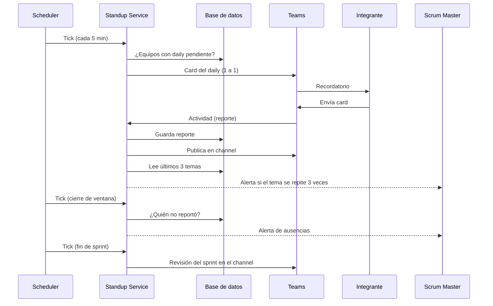

# C4 Model – Daily Scrum Tracker (Acme Corp)

> Entregable: diagramas C1, C2 y C3 en `acme-c4-model.drawio` (una pestaña por nivel) y este documento.

---

## 1. Qué entendí de cada nivel del C4 (preliminar)

**C1 – Contexto.** Es la vista más general. El sistema aparece como **una sola caja** rodeada de las personas que lo usan y de los otros sistemas con los que se conecta. No hay tecnologías ni detalles internos. Responde: *¿qué es, para quién es y con qué se relaciona?* Debe poder entenderlo alguien que no es técnico.

**C2 – Contenedores.** Se abre la caja del sistema y se ven sus **piezas grandes que se despliegan o ejecutan por separado** (una API, un proceso programado, una base de datos). "Contenedor" aquí no significa Docker. Se indica la tecnología de cada pieza y cómo se comunican. Responde: *¿de qué partes está hecho y con qué se construyó cada una?*

**C3 – Componentes.** Se abre **un solo contenedor** y se ven sus bloques internos, cada uno con una responsabilidad concreta (recibir, validar, analizar, notificar, guardar). Responde: *¿cómo está organizado por dentro este contenedor y qué hace cada bloque?* Está pensado para el equipo de desarrollo.

La idea central es hacer *zoom*: cada nivel añade detalle sin mezclar audiencias.

---

## 2. Resumen de la solución

**Daily Scrum Tracker** es una aplicación de Microsoft Teams que:

1. Envía a cada integrante un recordatorio personal a la hora del daily, con un formulario (card) de casillas predefinidas.
2. Recibe el reporte y lo valida.
3. Detecta quién no reportó al cerrar la ventana de tiempo.
4. Detecta cuando alguien reporta el **mismo tema 3 veces consecutivas** (posible bloqueo o estancamiento).
5. Publica cada reporte en el channel del equipo.
6. **(Aporte propio)** Al terminar cada sprint **genera automáticamente la revisión del sprint** a partir de los dailies, sin que nadie tenga que armarla a mano.

### 2.1 Inspiración vs. originalidad

Revisé el sitio de Standup & Prosper (standup-and-prosper.com). Según su página, es un bot de **Slack** para standups asíncronos: se elige un canal y las personas incluidas, se define el horario, se usan preguntas por defecto o personalizadas, hay recordatorio si alguien olvida reportar, las respuestas se publican en el canal en un hilo, y existe un historial con preguntas frecuentes y un resumen del estado del equipo.

De ahí tomé la **dinámica** (reportar al bot, recordatorio, publicación en el canal), pero la solución es distinta:

| Aspecto | Standup & Prosper (según su sitio) | Daily Scrum Tracker (esta propuesta) |
|---|---|---|
| Plataforma | Slack | Microsoft Teams |
| Preguntas | Por defecto o personalizadas, texto libre | Casillas **estructuradas** y predefinidas, incluyendo un **tema** elegido de una lista |
| Si alguien no reporta | Recordatorio | Recordatorio + **validación al cierre** con alerta y registro de la ausencia |
| Estancamiento | No se menciona en su sitio | **Detección de mismo tema 3 veces seguidas** y alerta al Scrum Master |
| Historial | Vista histórica con preguntas frecuentes y resumen | **Revisión de sprint automática** publicada en el channel con métricas del sprint |
| Modelo | Producto SaaS con planes de pago | Aplicación propia de Acme Corp, alojada en su cuenta de AWS |

El diferenciador principal es que el **tema estructurado** hace posible detectar el estancamiento de forma exacta (sin interpretar texto libre) y alimenta la revisión de sprint automática.

---

## 3. Requisitos y cómo se cubren

| # | Requisito | Componente(s) del C3 | Flujo |
|---|---|---|---|
| 1 | Notificaciones programadas a cada integrante | Reminder Service → Teams Notifier | Flujo A |
| 2 | Recibir el reporte en casillas predefinidas | Bot Controller → Report Service → Repository | Flujo B |
| 3 | Validar quién no reportó | Analysis Service → Teams Notifier | Flujo C |
| 4 | Mismo tema 3 veces consecutivas | Analysis Service → Teams Notifier | Flujo B (paso 8) |
| 5 | Publicar reportes en el channel | Report Service → Teams Notifier | Flujo B (paso 6) |
| + | Revisión de sprint automática | Sprint Review Generator → Teams Notifier | Flujo D |
| + | Construcción e implementación sencillas | Ver sección 8 | – |

---

## 4. C1 – Diagrama de contexto (detalle)

**Elementos**

| Elemento | Tipo | Descripción |
|---|---|---|
| Integrante del equipo | Persona | Developer, QA o diseñador que debe reportar su daily |
| Scrum Master / Líder | Persona | Revisa el cumplimiento, recibe alertas y lee la revisión del sprint |
| Daily Scrum Tracker | Sistema (el nuevo) | Automatiza recordatorios, recolección, validación, publicación y revisión de sprint |
| Microsoft Teams | Sistema externo | Canal por el que las personas interactúan con el sistema |
| Microsoft Entra ID | Sistema externo | Directorio de usuarios y equipos de la empresa |

**Relaciones**

| De → A | Qué ocurre |
|---|---|
| Integrante → Teams | Recibe el recordatorio y responde el daily |
| Scrum Master → Teams | Lee reportes, alertas y la revisión de sprint |
| Teams ↔ Daily Scrum Tracker | Teams entrega las respuestas; el sistema envía recordatorios, reportes, alertas y revisión |
| Daily Scrum Tracker → Entra ID | Obtiene los miembros y equipos |

**Decisión clave de este nivel.** Las personas **nunca usan el sistema directamente**: todo pasa por Teams. Por eso Teams es un sistema externo y no una parte del sistema. Esto también justifica que no se construya ninguna interfaz web propia.

---

## 5. C2 – Diagrama de contenedores (detalle)

El sistema se compone de **tres contenedores**.

| Contenedor | Tecnología | Responsabilidad |
|---|---|---|
| Scheduler | Amazon EventBridge Scheduler | Emite un "tick" cada 5 minutos |
| Standup Service | API + Bot en Node.js sobre AWS Lambda + API Gateway | Toda la lógica del daily y del sprint |
| Base de datos | Amazon RDS for PostgreSQL | Equipos, miembros, reportes, alertas y revisiones |

**Comunicación**

| De → A | Protocolo | Contenido |
|---|---|---|
| Teams ↔ Standup Service | HTTPS / JSON | Actividades del bot (card enviado) y mensajes salientes |
| Scheduler → Standup Service | HTTPS | Tick cada 5 minutos |
| Standup Service → Base de datos | SQL | Lectura y escritura |
| Standup Service → Entra ID | Microsoft Graph API | Consulta de miembros |

### 5.1 Por qué un "tick" cada 5 minutos y no un schedule por equipo

La alternativa era crear dinámicamente un schedule por equipo (con su hora y zona horaria). Eso obliga al servicio a administrar la API del scheduler cada vez que un equipo cambia su horario. En cambio, con **un solo schedule de tick**:

- La hora del daily, la zona horaria, la duración de la ventana y las fechas del sprint viven **en la base de datos**, así que cambiarlas es editar una fila.
- El servicio pregunta "¿qué equipos tienen algo pendiente ahora?" y actúa.
- Se evita enviar dos veces la misma acción con una tabla `job_runs` (equipo + tipo de tarea + fecha); si ya existe la fila, no se repite.
- Costo: unas 8.600 invocaciones al mes (12 por hora × 24 × 30), una cifra muy pequeña. Conviene verificar los precios vigentes de AWS al implementar.

Contrapartida: la precisión de las acciones es de ±5 minutos. Para un daily es perfectamente aceptable.

### 5.2 Decisiones tecnológicas y alternativas descartadas

**¿Por qué Amazon EventBridge Scheduler?**

| Opción | Evaluación |
|---|---|
| **EventBridge Scheduler (elegida)** | Servicio de AWS dedicado a programar tareas. Admite expresiones `rate` y `cron`, zonas horarias, puede invocar una Lambda directamente y no hay servidores que mantener. Es lo más corto de configurar |
| Reglas programadas de EventBridge | Sirven para lo mismo, pero Scheduler es el servicio pensado específicamente para programar y tiene más opciones de configuración |
| Cron dentro de un servidor (EC2/ECS) | Obliga a tener un proceso encendido 24/7 solo para disparar tareas, y hay que gestionarlo |
| Step Functions con espera | Es más potente de lo necesario para un tick sencillo |
| Power Automate dentro de Microsoft | Es posible, pero la lógica quedaría fuera del código versionado y es más difícil de probar |

**¿Por qué AWS Lambda + API Gateway para el Standup Service?**

| Opción | Evaluación |
|---|---|
| **Lambda + API Gateway (elegida)** | El tráfico es bajo e irregular (picos a la hora del daily). No se paga ni se administra un servidor ocioso. Teams necesita una URL HTTPS pública y API Gateway la entrega lista |
| ECS Fargate | Funciona bien, pero implica construir imágenes, definir servicio y balanceador. Más pasos para este volumen |
| EC2 | Máximo control, pero hay que parchear y operar la máquina |

*Riesgos de Lambda y mitigación.* (1) El primer arranque en frío puede tardar: el bot responde de inmediato a Teams y deja el trabajo pesado después. (2) Las conexiones a PostgreSQL desde Lambda pueden saturarse: se limita la concurrencia reservada y, si hiciera falta, se usa Amazon RDS Proxy.

**¿Por qué PostgreSQL en RDS?**

| Opción | Evaluación |
|---|---|
| **RDS for PostgreSQL (elegida)** | Los datos son relacionales (equipo → miembros → reportes → sprint). "Tres reportes consecutivos con el mismo tema" y las métricas del sprint se expresan de forma directa con SQL |
| DynamoDB | Opera sin servidor y sin conexiones que administrar, pero las agregaciones del sprint y las consultas flexibles resultan menos naturales. Sería la alternativa si se prioriza cero operación |
| Aurora Serverless | Escala automáticamente, pero es más pieza para un volumen que no la necesita |

**¿Por qué una app de Teams con bot y Adaptive Cards?**

| Opción | Evaluación |
|---|---|
| **Bot + Adaptive Cards (elegida)** | Permite enviar mensajes proactivos 1 a 1, recibir el formulario y publicar en un channel; es lo que exige el requisito |
| Webhook entrante | Solo envía hacia Teams; no recibe respuestas, así que no sirve para recolectar el reporte |
| Power Automate / Workflows | Más rápido para algo simple, pero la validación, la detección de estancamiento y la revisión de sprint serían difíciles de mantener |
| Pestaña web propia | Obliga a que la gente salga del chat; baja la adopción del daily |

**¿Por qué el SDK de Teams y no Bot Framework?** Microsoft archivó el Bot Framework SDK y dejó de atender tickets de soporte desde el 31 de diciembre de 2025. Para un proyecto nuevo se recomienda el **Teams SDK** (centrado en Teams) o el **Microsoft 365 Agents SDK** (para agentes multicanal). Como esta solución vive solo en Teams, elijo el Teams SDK. Si Acme quisiera después el mismo bot en otros canales, el cambio sería hacia el Agents SDK.

**¿Por qué Node.js?** El SDK de Teams y el Agents Toolkit tienen soporte para TypeScript/JavaScript, y Lambda lo ejecuta de forma nativa. Podría ser .NET si el equipo ya lo domina; no cambia el diagrama.

**¿Por qué Entra ID sigue apareciendo si usamos AWS?** Teams y sus usuarios pertenecen al tenant de Microsoft. El bot necesita un registro de aplicación para autenticarse, y los miembros se identifican por su Entra ID. Lo único que se aloja en AWS es **nuestro código y nuestros datos**.

---

## 6. C3 – Diagrama de componentes del Standup Service (detalle)

Se eligió detallar el *Standup Service* porque es el contenedor donde está toda la lógica.

| Componente | Responsabilidad | Entradas | Salidas |
|---|---|---|---|
| **Reminder Service** | Cuando toca el daily de un equipo, arma el card con casillas y lo envía a cada integrante activo | Tick del Scheduler; miembros y horario (Repository) | Card al Teams Notifier |
| **Bot Controller** | Recibe y autentica las actividades que llegan desde Teams; solo enruta, no tiene lógica | Actividad de Teams | Reporte al Report Service |
| **Report Service** | Valida campos obligatorios, evita duplicados, guarda el reporte y dispara la publicación y el análisis | Reporte del Bot Controller | Guardado, publicación y evaluación |
| **Analysis Service** | (a) Al cerrar la ventana, busca quién no reportó. (b) Tras cada reporte, revisa si el tema se repitió 3 veces seguidas | Tick; reporte nuevo; historial | Alertas al Teams Notifier |
| **Sprint Review Generator** | Al terminar el sprint, calcula métricas del periodo y arma la revisión automática | Tick; reportes y alertas del sprint | Revisión al Teams Notifier |
| **Teams Notifier** | **Único** punto de salida hacia Teams: envía recordatorios, publica reportes, alertas y la revisión | Peticiones de los otros componentes | Mensajes en Teams |
| **Repository** | Único acceso a la base de datos | Consultas de los demás componentes | Datos |

**Por qué esta división**

- **Un solo Teams Notifier** y **un solo Repository**: cualquier cambio en la forma de hablar con Teams o con la base de datos se hace en un único lugar.
- **Bot Controller sin lógica**: solo recibe, así el negocio no queda atado a Teams y se puede probar sin él.
- **Analysis Service junto**: ausencias y estancamiento son dos formas de analizar los reportes; comparten las mismas lecturas.
- **Sprint Review Generator aparte**: tiene su propio disparador (fin de sprint) y su propia salida; mezclarlo con Analysis sería confundir "alertar sobre hoy" con "resumir un periodo".

---

## 7. Flujos de funcionamiento

### Flujo A – Recordatorio diario
1. El Scheduler emite un tick cada 5 minutos.
2. El Reminder Service consulta qué equipos ya pasaron su hora de daily (según su zona horaria) y no tienen registro en `job_runs` para hoy.
3. Por cada equipo, obtiene los integrantes activos.
4. Arma el **card** del daily con las casillas (ver 7.1).
5. El Teams Notifier lo envía como mensaje proactivo 1 a 1 a cada integrante.
6. Se registra `job_runs` (equipo, "recordatorio", fecha) para no repetirlo.

### Flujo B – Recepción de un reporte
1. El integrante completa el card y pulsa **Enviar**.
2. Teams envía la actividad al endpoint HTTPS; el **Bot Controller** la autentica.
3. Pasa el reporte al **Report Service**.
4. El Report Service valida los campos obligatorios; si falta alguno, responde indicando cuál.
5. Guarda el reporte vía **Repository** (uno por persona y día; si lo reenvía antes del cierre, se actualiza).
6. Pide al **Teams Notifier** publicar el reporte en el channel del equipo y confirma a la persona.
7. Pide al **Analysis Service** evaluar el reporte.
8. El Analysis Service lee los últimos reportes de esa persona; si los **3 últimos días hábiles tienen el mismo tema**, crea una alerta de estancamiento y el Teams Notifier avisa al Scrum Master.

### Flujo C – Cierre de la ventana y ausencias
1. En un tick, el **Analysis Service** detecta equipos cuya ventana (hora del daily + minutos configurados) ya cerró y sin registro de cierre hoy.
2. Compara miembros activos contra reportes del día.
3. Por cada persona sin reporte crea una alerta de ausencia.
4. El Teams Notifier avisa al Scrum Master y publica en el channel la lista de pendientes.
5. Se registra el cierre en `job_runs`.

### Flujo D – Revisión de sprint automática
1. En un tick, el **Sprint Review Generator** revisa si hoy es el último día del sprint de algún equipo y si aún no se generó la revisión.
2. Lee de la base de datos los reportes y alertas del periodo.
3. Calcula las métricas (ver 7.2).
4. Arma el mensaje de revisión.
5. El Teams Notifier lo publica en el channel y se guarda en `sprint_reviews`.

### 7.1 Casillas del card (propuesta)

| Casilla | Tipo | Obligatoria |
|---|---|---|
| ¿Qué hice ayer? | Texto corto | Sí |
| ¿Qué haré hoy? | Texto corto | Sí |
| Tema principal de hoy | Lista desplegable (Desarrollo, Pruebas, Revisión de código, Diseño, Investigación, Soporte, Reuniones, Otro) | Sí |
| ¿Tienes bloqueos? | Sí / No + texto si es Sí | Sí |
| Referencia (ticket o historia) | Texto corto | No |

La casilla **Tema principal** es la base de la regla de estancamiento.

### 7.2 Reglas y métricas

**Estancamiento.** Mismo tema en los 3 últimos días hábiles con reporte. El umbral (3) es configurable por equipo. Se cuentan solo días hábiles (lunes a viernes) en la primera versión.

**Ausencia.** Miembro activo sin reporte al cerrar la ventana (por defecto 2 horas después de la hora del daily, configurable).

**Contenido de la revisión del sprint**
- Porcentaje de participación del equipo y por persona.
- Ausencias por persona.
- Distribución de temas (en qué se fue el esfuerzo del sprint).
- Bloqueos reportados y los que se repitieron en varios días.
- Alertas de estancamiento generadas y a quién correspondieron.
- Comparación con el sprint anterior.

---

## 8. Construcción e implementación sencillas

**Por qué es sencilla**

- Solo **3 contenedores** y ninguna interfaz web propia.
- **Serverless**: no hay servidores ni imágenes que mantener.
- **Todo configurable en datos**, no en infraestructura: horarios, umbrales y fechas de sprint son filas de la base de datos.
- **Sin IA ni procesamiento de lenguaje**: las reglas se basan en casillas estructuradas, por eso son predecibles y fáciles de probar.
- **Un solo repositorio de código** y un solo despliegue.

**Pasos propuestos**

1. Registrar la aplicación y el bot en Microsoft (Entra ID) y generar el paquete de la app de Teams con el Microsoft 365 Agents Toolkit.
2. Crear en AWS, con una plantilla de infraestructura como código (por ejemplo AWS SAM): API Gateway, la Lambda, el schedule de tick y la base RDS.
3. Implementar el Bot Controller, el Teams Notifier y el Repository (la base técnica).
4. Implementar el Flujo A y el B (recordatorio y reporte + publicación): ya se tiene un daily funcional.
5. Añadir el Analysis Service: ausencias y estancamiento (Flujos B-8 y C).
6. Añadir el Sprint Review Generator (Flujo D).
7. Probar con un equipo piloto y ajustar horarios, umbral y lista de temas.
8. Instalar en la organización (administración de aplicaciones de Teams).

**Datos mínimos que guarda el sistema**

| Tabla | Campos principales |
|---|---|
| `teams` | id, nombre, zona horaria, hora del daily, minutos de ventana, umbral de repetición, id del channel, Scrum Master, inicio y duración del sprint |
| `members` | id, equipo, id de Entra ID, nombre, activo, referencia de conversación (para mensajes proactivos) |
| `reports` | id, miembro, fecha, ayer, hoy, tema, bloqueo, texto del bloqueo, referencia |
| `alerts` | id, equipo, miembro, tipo (ausencia o estancamiento), fecha, detalle |
| `job_runs` | equipo, tipo de tarea, fecha (evita acciones duplicadas) |
| `sprint_reviews` | id, equipo, sprint, contenido, fecha |

**Requisito de adopción.** Para poder escribirle a alguien de forma proactiva, el bot debe estar instalado para esa persona (o desplegado por la administración de Teams). Ese paso guarda la referencia de conversación.

---

## 9. Lógica de estructuración (explicación breve)

Partí de que todo debe ocurrir dentro de Microsoft Teams, así que en C1 Teams es el único punto de contacto de las personas y Entra ID aparece para no duplicar usuarios. Mantuve el sistema pequeño en C2: un scheduler que solo emite un tick, un servicio con toda la lógica y una base de datos. Dejar los horarios en la base de datos, y no en la infraestructura, hace que el sistema sea fácil de configurar y de construir.

En C3 organicé el servicio por responsabilidades: recordar, recibir, guardar, analizar, resumir y comunicar. Todo lo que sale hacia Teams pasa por un único Teams Notifier y todo acceso a datos por un único Repository. El aporte original es que, al estructurar las casillas (especialmente el tema), el sistema puede detectar estancamientos con exactitud y generar por sí mismo la revisión del sprint, de modo que las dailies dejan de ser solo un registro y se convierten en la fuente de la revisión.

---

## 10. Fuera de alcance de C1–C3 (y supuestos)

- **Modelo de datos detallado, despliegue de redes (VPC), entornos y seguridad en profundidad**: se resolverían en una etapa posterior de diseño. Se anotan como puntos a decidir: secretos en AWS Secrets Manager, tiempo de retención de los reportes y quién puede ver las ausencias.
- **Supuestos a confirmar con el equipo**: umbral de 3 repeticiones, ventana de 2 horas, publicar la lista de ausentes en el channel (en vez de solo avisar al Scrum Master), y que los festivos no se consideran en la primera versión.
- **Posible evolución**: un segundo recordatorio para quienes no han reportado, y un resumen redactado con IA sobre la revisión del sprint.
